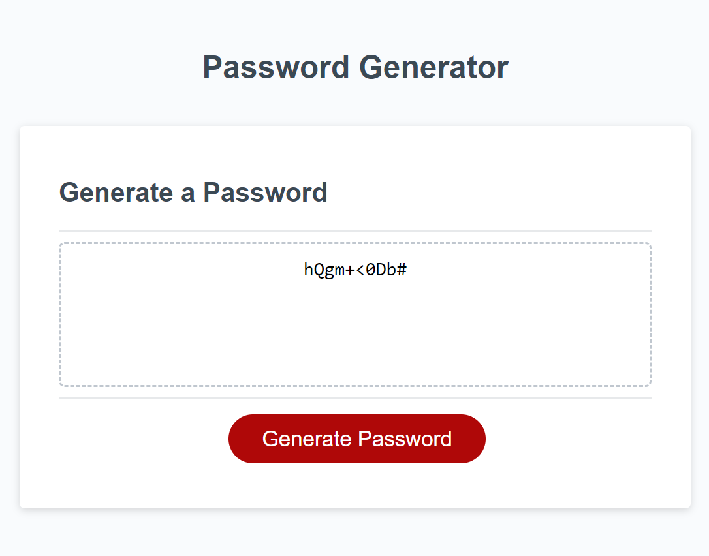

# Password Generator

## Table of Contents
- [Description](#description)
- [Technologies](#technologies)
- [Links](#links)
- [Screenshot](#Screenshot)

## Description 
This is a password generator that will ask the user for a desired password length that is between 8 and 128, if they want uppercase, lowercase, special characters, or numbers. Based on the users input a password will be created.

## Technologies
* HTML
* CSS
* JavaScript

## Links
[GitHub Repo](https://github.com/sampena118/PasswordGenerator)\
[Live URL](https://sampena118.github.io/PasswordGenerator/)

## Screenshot
